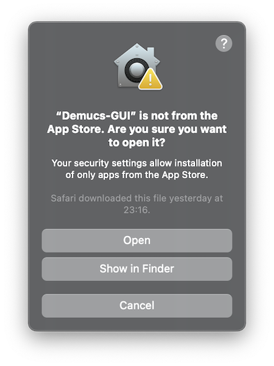

# Demucs GUI usage

**Everybody is welcomed to contribute to this document! Please refer to [#23](https://github.com/CarlGao4/Demucs-Gui/discussions/23) for more information.**

**This document is written for 1.0 or newer versions (including beta versions like 1.0a1). A function without version information means that it is available from 1.0a1.**

## Quick Start

1. Download the latest version of Demucs GUI from [GitHub Releases](https://github.com/CarlGao4/Demucs-Gui/releases) or [FossHUB](https://www.fosshub.com/Demucs-GUI.html). There are different download types:
- `CUDA Windows 64-bit`: For Windows users with NVIDIA GPU (whose compute capability is greater than 3.5).
- `CPU Windows 64-bit`: For Windows users without accelerators (e.g. GPU).
- `MKL Windows 64-bit`: For Windows users with Intel GPU (Intel Arc & Intel Xe). Not recommended to users who only have integrated Intel GPU.
<!-- - `ROCm Windows 64-bit`: For Windows users with AMD GPU. -->
- `CPU macOS 64-bit`: For macOS users with Intel CPU.
- `CPU, MPS macOS ARM64`: For macOS users with Apple Silicon CPU. MPS acceleration is available.
- `CPU macOS 64-bit; MPS macOS Rosetta 2`: For macOS users (Both Intel Mac and Apple Silicon Mac). You may need to install Rosetta 2 on Apple Silicon Mac. MPS acceleration is available on Apple Silicon Mac.
<!-- - `MPS macOS ARM64`: For macOS users with Apple Silicon CPU. -->

<!-- *\*Not all releases are ready for download* -->

2. Extract the downloaded file
- Windows: 7z format, can be extracted with [7-Zip](https://www.7-zip.org/). If you are using Windows 11 23H2, you can also directly extract the file with Windows Explorer.
- macOS: dmg format. Double click the dmg file to mount it, then drag the app to your Applications folder. 

3. Run Demucs GUI
- Windows: Double click `Demucs-GUI.exe` in the extracted folder.
- macOS: Open it from your Applications folder.

  
macOS: I cannot run this program

If the application cannot be launched due to the Mac's security protection feature, try the following:

1. Right-click on the Demucs-GUI app icon and select "Open".
2. Click "Open" again in the window that appears as follows.

4. Load a model. The default model packed with Demucs GUI is `htdemucs`. Click on `load` button to load. If you have chosen a remote model and are using it for the first time, it will be downloaded automatically. ~~During this period of time, there will be no outputs and the whole window will be frozen. Please be patient.~~ *\*From 1.1a1, download progress will be shown in the status bar.*

5. Add your audio file. You can drag and drop your audio file to the window, or choose files and folders (recursively).

6. Click `Start separate` to separate your file! Just keep the default parameters for now and it will be fine. If the separation failed, please refer to [Failed to separate an audio](#Failed-to-separate-an-audio).

### [Notes for users using MKL release (Intel GPU)](MKL-AOT.md)

## Advanced Usage

### Load custom models

There are two default model repos: one just under `pretrained` folder of the Demucs GUI executable, one under the config folder of Demucs GUI. On Windows, it is `%APPDATA%\demucs-gui\pretrained`. On macOS and Linux, it is `~/.config/demucs-gui/pretrained`. You can put your custom models in these folders.

It is also possible to add custom repos. Click on `advanced` button, and you will be able to manage your custom repos.

Model list will be updated automatically after you add or remove a repo. You can also click `refresh` button to force update.

The order of listed models is bag of models (yaml file) first, and single models (th file) goes after them. Models with same name from different repos can be listed multiple times, so you should take a look at the info area of the selected model before loading it.

Once you've loaded a model, you can't load another model or unload it. The only way to unload a model is to restart Demucs GUI. I know that this may be annoying, but it's impossible to know the sources of a model without loading it, so the first thing you must do after launching Demucs GUI is to load a model so other functions (like the mixer) can be initialized. As a result, I added a "restart" button to the menu bar (*\*New in 1.1a2*).

### Mixer
*\*New in 1.1a2*

With mixer, you can mix different stems of a song together. This is more convenient than using a DAW when your purpose is simple (like just removing vocals from a song).

On default, Demucs GUI has following outputs:

1. "Single stems": Do not mix at all, save the outputs of each stem separately. This is enabled by default.
2. "Minus stems": Extract the specific stem from original audio (Or, original audio minus the specific stem).
3. "No stems": Mix all the stems except the specific stem together. ***Not recommended** personally as "other" stem is treated same as stems like "vocals", which means adding up all the stems does not equal to the original audio. I'd suggest use the minus stems above instead.*

These outputs are created for each stem.

You can enable or disable a stem by clicking on the checkbox on the left of the stem name. If you've selected more than one cells and clicked on a checkbox whose row has been selected, all the selected cells will be enabled or disabled.

Double click on a cell of stem name to edit the name of the stem (this name will be used in the output file name variable `{stem}`). Double click on a cell of stem volume to edit the volume of the stem. The volume is a percentage from -500% to 500%. You can also change the value of all selected cells by dragging the slider on the bottom of the mixer. The parameters of default outputs can't be changed.

You can also add your own stems by clicking "Add" button. Remember that **do not enable a stem with the same name as an existing stem**. The behavior of this is undefined.

#### Presets

You can save the current mixer settings as a preset. The same preset can be used on any model with same stems. A preset will save custom stems and their enabled status and volume.

You can also set a preset as default. The default preset will be loaded when you load a model with same stems. When you click on "Save as default" button, the preset selected in the dropdown list will be set as default, but not the current settings. To save the current settings as default, you should first save it as a preset, then set it as default.

### Separation parameters

#### Segment

Demucs GUI will split the audio into segments and separate them one by one. The larger a segment is, the more memory it will require. Please remember that too small segment may decrease the quality of separation.

#### Overlap

The overlap between two segments. The larger the overlap is, the longer the separation will take. But it can make connection between two segments smoother.

#### Shifts

This will shift the start of segments by a random amount within 0 and 0.5s several times. This will make the results better. Your input will determine how many times the audio will be separated with shift applied.

#### Device

Choose which device to use. If you install ROCm version, your AMD GPU will also be listed as `CUDA`. If you are separating `HDemucs` model on macOS, I'd suggest you to use `CPU` instead of `MPS` to speed up up to 10x (though I don't know why).

### Save opetions

#### Save file location

- `Relative path`: Save output files in the same location of the source file
- `Absolute path`: Save output files directly to the path. Please remember that it must start from root dir (like `/` on *nix and `C:\` on Windows) or something unexpected will happen.

You can use variables to rename your output file. Variables `{track}`, `{trackext}`, `{stem}`, `{ext}`, `{model}` will be replaced with track name without extension, track extension, stem name, default output file extension and model name.

For example, when saving stem "vocals" of "audio.mp3" using model htdemucs, with output format flac, the default location `separated/{model}/{track}/{stem}.{ext}` would be "separated/htdemucs/audio/vocals.flac", with the folder "separated" created under the same folder of the original audio file.

Demucs GUI will overwrite existing files without warning. Remember to include `{stem}` in your output file name.

### Reading with FFMpeg

Demucs GUI will use FFMpeg to read files if the default backend Soundfile (which uses libsndfile) fails, which enables separating a video (its audio stream, actually). When reading with FFMpeg, Demucs GUI will call `ffmpeg -v level+warning -i "{file}" -map a:0 -ar {samplerate} -c:a pcm_f32le -f wav -` and decode the stdout. So only the first stream of the file will be separated. If the file contains no audio stream, separation will fail. *\*New in 1.0*

Demucs GUI will calls FFMpeg according to PATH environment variable. Before detecting FFMpeg, `./ffmpeg` will be added to PATH. You can control where to insert it (before or after the original PATH) in the config file. *\*New in 1.0*

### Encoder

Demucs GUI supports two encoders: `soundfile` and `ffmpeg`. `soundfile` is the default encoder which uses libsndfile. It is faster and simpler, but only supports `wav` and `flac` format (available sample formats are `int16`, `int24`, `float32`; `float32` is only available for `wav`). `ffmpeg` supports more complex formats and codecs, but is likely to fail if you didn't enter the command correctly. *\*New in 1.2a1*

#### FFMpeg options

You only need to enter a command line and target file extension. Demucs GUI will encode separated audio to wav format (float32 sample format) and pipe it to ffmpeg stdin. Please remember to add `-sample_fmt {Your_sample_format}` to the command line if you want to use other sample formats (like `s16` or `s24`). You can read more about FFMpeg options in [FFMpeg documentation](https://ffmpeg.org/ffmpeg-all.html#Audio-Options). Your command line will be splitted using Python library `shlex` (which uses Linux shell syntax) and you can see the splitted command line as you type in your command. FFMpeg stdout will be ignored and stderr will be logged to log file.

There are several variables you can use in the command line and target file extension:
- `{input}`: input file name without extension
- `{inputext}`: input file extension
- `{inputpath}`: input file path (without file name)
- `{output}`: output file full path (not available in target file extension)

You can also save presets for FFMpeg options. Each preset will save the command line and target file extension. Its usage is same as the mixer presets (except that every preset can be apply to model), which you can refer to [Mixer presets](#Presets).

There are three default presets: `MP3`, `AAC`, `Copy video stream`. You can use them as an example.

##### `MP3`

Command: `ffmpeg -y -v level+warning -i - -c:a libmp3lame -b:a 320k {output}`

Extension: `mp3`

Encode separated audio to mp3 format with 320k bitrate (You can change it in the command line).

##### `AAC`

Command: `ffmpeg -y -v level+warning -i - -c:a aac -b:a 320k {output}`

Extension: `m4a`

Encode separated audio to m4a format with 320k bitrate (You can change it in the command line).

##### `Copy video stream`

Command: `ffmpeg -y -v level+warning -i - -i {inputpath}/{input}.{inputext} -map 1:v -map 0:a -c:v copy {output}`

Extension: `{inputext}`

Copy the first video stream of the input file and the separated audio to the output file. The output file will have the same extension as the input file. Please note that this may fail due to complex reasons. To check the actual reason, you may need to check the log file and search for FFMpeg documentation.

### Some "useless" functions of separation queue

1. You can drag and drop files to the queue to add them. (It's quite useful, isn't it?) But one thing is not supported: You can't drag a file or a folder from Windows to the application ran in WSL.

2. You can click on the header `File` to show full file path or file name. Hover on an item in the queue to show its full path.

3. On Windows, the progress bar should have animation. However, rendering a lot of progress bars at the same time (like the queue) will consume a lot of CPU resources. So, the animation is disabled in the queue (animation will still be rendered when the text like percentage changes). I don't like this, so I added this: If you click on the header `Status`, the animation will be enabled. Click again to disable it.

4. The default style on macOS (`macOS`) can't render progress bars correctly inside a table, so the style of the queue is changed to `Fusion` on macOS and may looks different from the main window. *\*New in 1.0*

## About the config file

Demucs GUI will create a config file in the config folder of Demucs GUI. On Windows, it is `%APPDATA%\demucs-gui\settings.json`. On macOS and Linux, it is `~/.config/demucs-gui/settings.json`. You can edit it to change the default parameters of separation.

Please remember that there is no validation of the config file. If you make a mistake, Demucs GUI may not work properly. If you want to reset the config file, just delete it.

Here are some of keys and their meanings:

### `style`

type: `string`

The style of the application. Available values can be found in log file. The default value is `windowsvista` on Windows and `macos` on macOS. The separation queue will always use `fusion` on macOS. The values are case insensitive. *\*New in 1.0*

### `prepend_ffmpeg_path`

type: `boolean`

If true, `./ffmpeg` will be added to PATH before the original PATH. If false, `./ffmpeg` will be added to PATH after the original PATH. The default value is `false`. *\*New in 1.0*

### `custom_repo`

type: `array[string]`

An array of custom repos. This can be set inside the application (click on `advanced` button). The default value is `[]`. The default repos (See [Load custom models](#Load-custom-models)) will be prepended to this array.

### `file_list_animation`

type: `boolean`

See [Some "useless" functions of separation queue](#Some-useless-functions-of-separation-queue) 3rd point.

### `model_cache`

type: `string`

The path to the model cache, where the downloaded remote models will be saved and seeked. The default value is same as the default custom repo (On Windows, it is `%APPDATA%\demucs-gui\pretrained`; On macOS and Linux, it is `~/.config/demucs-gui/pretrained`). Due to the implementation of torch hub, Demucs GUI will create a new folder named `checkpoints` under the model cache folder and put all the downloaded models there. If you've changed the model cache folder, please copy the old models to the new folder. *\*New in 1.1a1*

## Q&A

### Why is the model loading so slow?

If you have chosen a remote model and are using it for the first time, it will be downloaded automatically. During this period of time, there will be no outputs and the whole window will be frozen. Please be patient.

From 1.1a1, download progress will be shown on the status bar.

### The application triggers my antivirus software

Demucs GUI is packed with PyInstaller. All softwares packed with PyInstaller uses similar bootloader with different payloads. Once a new version of PyInstaller is released, countless developers will package their softwares with the latest version and distribute them. This may be seen as a virus as viruses can hide themselves in normal softwares, which contains different payloads but the same bootloader and spread all around the world.

I promise that Demucs GUI is safe. You can check the source code and build it yourself. If you still don't trust me, you can use the source code to build your own version of Demucs GUI.

### The progress bar is not moving

The progress bar is discrete, not continuous. It will only update when a segment is separated. The approximate time is 1.5 times of the length of the audio file using CPU (i5 or i7, 8th to 11th gen). Using a GPU (CUDA) can speed up about 20 times. Using a GPU (MPS) can speed up about 5 times for HTDemucs models and ***slow down*** about 2 times for Demucs models.

### Failed to separate an audio

Until now, there are only three possible reasons for this:

1. Failed to read the audio. Maybe you forgot to add read permission to the audio file, or the audio file is broken, or the audio file is not supported by Demucs.

2. Failed to write the audio. Most likely that you forgot to add write permission to the folder you want to save the separated audio. And, FLAC format does NOT support float32. From 1.2a1, you can also use FFMpeg to encode your output, so FFMpeg can also be the reason to fail if your command is not correct.

3. Out of memory. There are two kinds of out of memory:
- Out of system memory: The solution to this is to truncate the audio file into smaller pieces (or enlarge your swapfile on Linux). Demucs GUI will read the whole audio into memory and convert it into float32 format. The separated stems are also saved in memory before written. If the audio is too long, it will consume too much memory and cause out of memory.

- Out of GPU memory: **This is the most common reason that causes a separation to fail.** Please use smaller `segment`. The larger a segment is, the more memory it will require. Please remember that too small segment may decrease the quality of separation. If GPU is still out of memory, please use CPU to separate.

4. That's impossible. Please open an issue to report this.

### Still didn't solve your problem? You can [ask a question](https://github.com/CarlGao4/Demucs-Gui/discussions/new?category=q-a)
